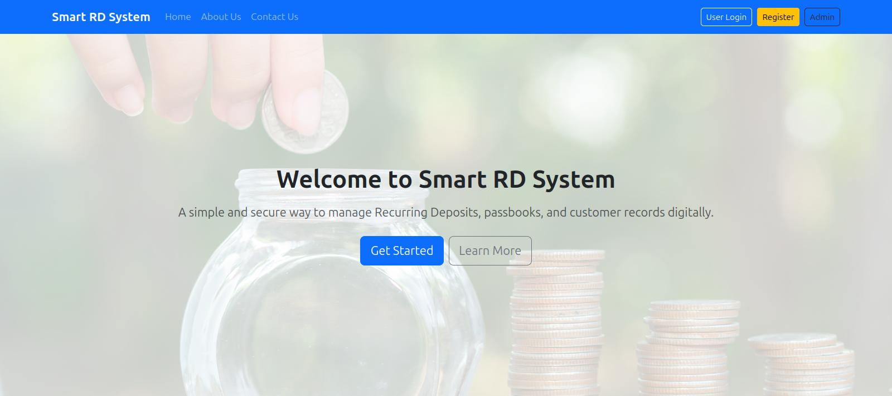
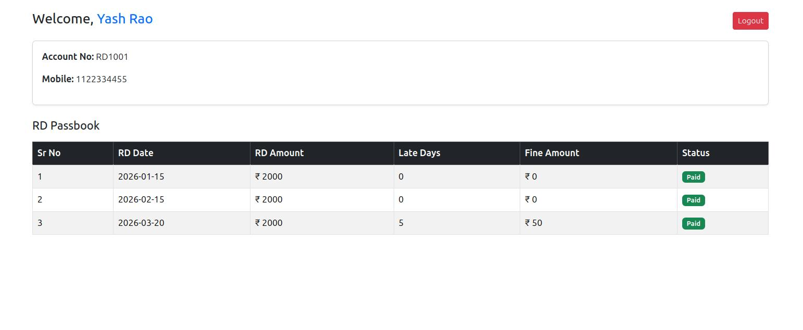
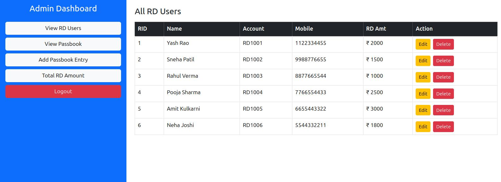
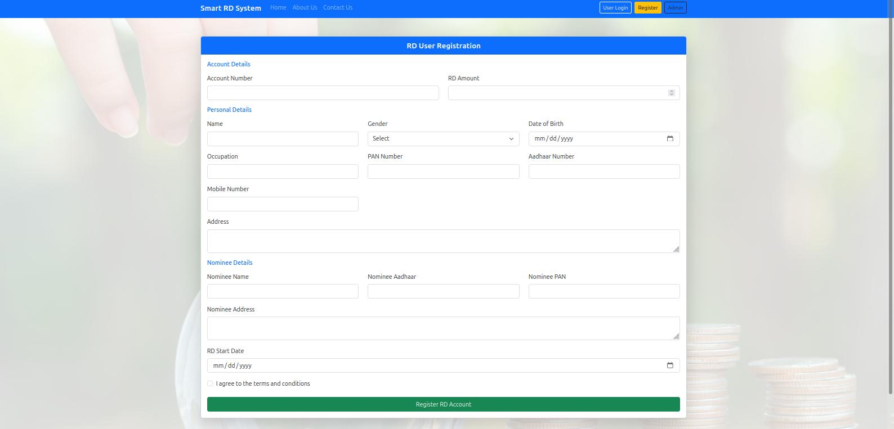
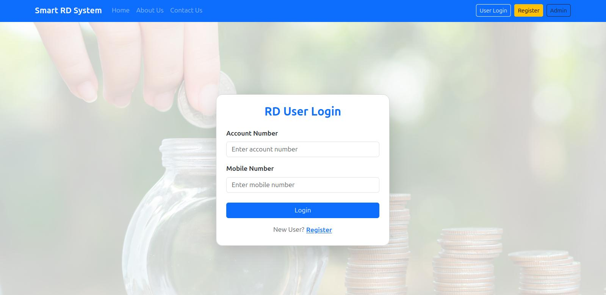
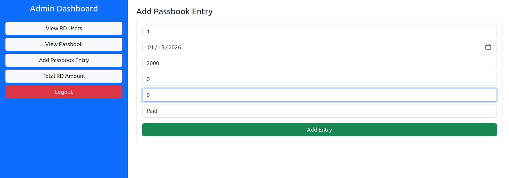
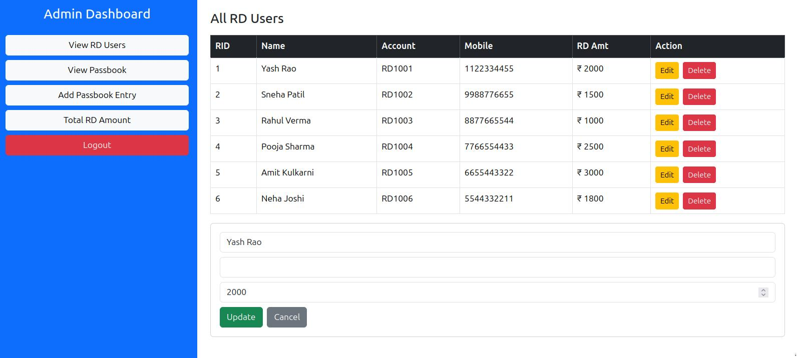
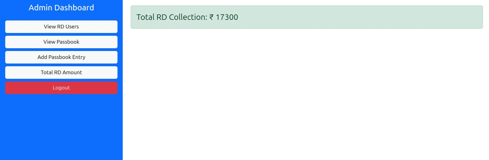

# Smart RD System

## 📋 Overview
A comprehensive Recurring Deposit (RD) Management System with user and admin interfaces for managing RD accounts, transactions, and passbook entries.

## 🚀 Features

### User Features
- User Registration and Login
- Dashboard for RD account management
- Passbook viewing and management
- RD amount calculation and tracking
- Transaction history

### Admin Features
- Admin Login and Dashboard
- User management (add/edit/view)
- System monitoring
- RD management

## 📁 Project Structure
Smart-RD-System/
├── frontend/ # React/Vite frontend application
│ ├── src/
│ ├── public/
│ ├── package.json
│ └── vite.config.js
├── backend/ # Spring Boot/Java backend
│ ├── src/
│ ├── build.gradle
│ └── gradlew
├── screenshots/ # Application screenshots
│ ├── AdminDash.jpg
│ ├── UserDash.jpg
│ ├── HomePage.jpg
│ └── ...
└── README.md # This file


## 🖼️ Screenshots

### Home Page


### User Dashboard


### Admin Dashboard


### User Registration


### User Login


### Admin Login


### Passbook Management



### User Management


### RD Amount Calculation


## 🛠️ Technology Stack

### Frontend
- React.js
- Vite
- HTML/CSS/JavaScript
- Axios for API calls

### Backend
- Spring Boot
- Java
- Gradle
- MySQL/PostgreSQL (Database)

## 📦 Installation & Setup

### Prerequisites
- Node.js (v16+)
- Java JDK (11+)
- MySQL/PostgreSQL

### Backend Setup
```bash
cd backend
./gradlew build
./gradlew bootRun
